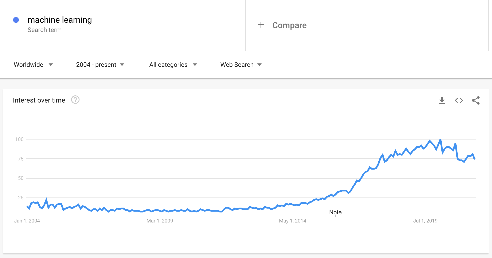

# 机器学习简介

> 🎥 点击播放视频查看机器学习，人工智能、深度学习三者有什么不同.

## [课前测试](https://jolly-sea-0a877260f.azurestaticapps.net/quiz/1/)

### 简介

欢迎开始这个针对初学者的机器学习课程！无论你是初次接触这个领域，或者你是一个某一领域机器学习的专家，我们都欢迎你和我们一块从这个课程开始。这门课程是一个很好的开始，我们希望你能学习、评价并能[反馈](https://github.com/microsoft/ML-For-Beginners/discussions)给我们.

> 🎥 点击播放视频: MIT's John Guttag 的机器学习介绍
### 开始机器学习

在可是课程之前，你需要在你的个人电脑上准备好本地的notebooks环境。

- **根据视频配置你的电脑**. 如何配置： [set of videos](https://www.youtube.com/playlist?list=PLlrxD0HtieHhS8VzuMCfQD4uJ9yne1mE6).
- **学习Python语言**. 在本课程里会用到python语言，并且Python在数据科学领域是一个非常常用的语言。可以通过这个链接[Python](https://docs.microsoft.com/learn/paths/python-language/?WT.mc_id=academic-15963-cxa)来学习Python的一些基本概念。
- **学习 Node.js and JavaScript**. 后面有几个小结我们会做一个web程序，所以你也需要安装 [node](https://nodejs.org) 和 [npm](https://www.npmjs.com/) 环境, 同时，我们建议安装 [Visual Studio Code](https://code.visualstudio.com/) 作为两者的开发环境。
- **创建一个 GitHub 账号**. 虽然你可以从这个[GitHub](https://github.com)地址得到代码, 但是你最好有一个自己的github账号。然后克隆这个代码库到你自己的账号下. (给个star的人是最帅的 😊)
- **熟悉 Scikit-learn**.  [Scikit-learn](https://scikit-learn.org/stable/user_guide.html)也是必须要熟悉的,他包含了一系列机器学习所有到的工具库。

### 什么是机器学习？

机器学习是当前非常流行的一个术语。无论你再哪一个领域，只要你对技术有一些熟悉，你应该不止一次听到过这个术语。对大部分人，尤其是初学者来说，机器学习是非常神秘的，但是通过这门课程的例子的学习，我们可以一步步解到机器学习是什么。

> 谷歌趋势展示了当前“机器学习”的搜索热度。

我们生活在一个充满迷人奥秘的宇宙中。 像史蒂芬·霍金、阿尔伯特·爱因斯坦这样的伟大科学家，还有更多的人，毕生致力于寻找有意义的信息，揭示我们周围世界的奥秘。 这就是人类学习的状态:人类的孩子在成长为成年人的过程中，年复一年地学习新事物，揭示他们的世界结构。  

孩子的大脑和感官感知他们周围的事实，并逐渐学习隐藏的生活模式，这有助于孩子制定逻辑规则，以识别学到的模式。 人类大脑的学习过程使人类成为世界上最复杂的生物。 通过发现隐藏的模式不断学习，然后在这些模式上进行创新，使我们在一生中变得越来越好。 这种学习能力和进化能力与[大脑可塑性有关](https://www.simplypsychology.org/brain-plasticity.html)。 从表面上看，我们可以得出人脑的学习过程和机器学习的概念之间有一些动机上的相似之处。  

[人类大脑](https://www.livescience.com/29365-human-brain.html)从现实世界中感知事物，处理感知到的信息，做出理性的决定，并根据环境采取某些行动。 这就是我们所说的智能行为。 当我们将智能行为过程的摹本编程给机器时，它被称为人工智能(AI)。  

尽管术语可能会混淆，但机器学习(ML)是人工智能的一个重要子集。 **ML关注的是使用专门的算法来发现有意义的信息，并从感知数据中发现隐藏的模式，以证实理性的决策过程**。

> 这张图展示了人工智能、机器学习、深度学习、数据科学之间的关系。 [Jen Looper](https://twitter.com/jenlooper) 启发自 [this graphic](https://softwareengineering.stackexchange.com/questions/366996/distinction-between-ai-ml-neural-networks-deep-learning-and-data-mining)

## 这门课里你将要学到什么

在本课程中，我们将只涵盖初学者必须知道的机器学习的核心概念。 我们主要使用Scikit-learn来学习我们所谓的“经典机器学习”，这是一个许多学生用来学习基础知识的优秀库。 本门课程主要是机器学习的基础知识，但是要理解更广泛的人工智能或深度学习的概念，这些知识都是必不可少的。  

在本课程中，你将学习到:  
 
- 机器学习的核心概念  
- 机器学习的历史  
- 机器学习和公平  
- 机器学习回归  
- 机器学习分类   
- 聚类技术  
- 自然语言处理  
- 时间序列预测    
- 强化学习  
- 机器学习的真实世界应用    
## What we will not cover

- deep learning
- neural networks
- AI
  
To make for a better learning experience, we will avoid the complexities of neural networks, 'deep learning' - many-layered model-building using neural networks - and AI, which we will discuss in a different curriculum. We also will offer a forthcoming data science curriculum to focus on that aspect of this larger field.
## Why study machine learning?

Machine learning, from a systems perspective, is defined as the creation of automated systems that can learn hidden patterns from data to aid in making intelligent decisions.

This motivation is loosely inspired by how the human brain learns certain things based on the data it perceives from the outside world.

✅ Think for a minute why a business would want to try to use machine learning strategies vs. creating a hard-coded rules-based engine.

### Applications of machine learning

Applications of machine learning are now almost everywhere, and are as ubiquitous as the data that is flowing around our societies, generated by our smart phones, connected devices, and other systems. Considering the immense potential of state-of-the-art machine learning algorithms, researchers have been exploring their capability to solve multi-dimensional and multi-disciplinary real-life problems with great positive outcomes.

**You can use machine learning in many ways**:

- To predict the likelihood of disease from a patient's medical history or reports.
- To leverage weather data to predict weather events.
- To understand the sentiment of a text.
- To detect fake news to stop the spread of propaganda.

Finance, economics, earth science, space exploration, biomedical engineering, cognitive science, and even fields in the humanities have adapted machine learning to solve the arduous, data-processing heavy problems of their domain.

Machine learning automates the process of pattern-discovery by finding meaningful insights from real-world or generated data. It has proven itself to be highly valuable in business, health, and financial applications, among others.

In the near future, understanding the basics of machine learning is going to be a must for people from any domain due to its widespread adoption.

---
## 🚀 Challenge

Sketch, on paper or using an online app like [Excalidraw](https://excalidraw.com/), your understanding of the differences between AI, ML, deep learning, and data science. Add some ideas of problems that each of these techniques are good at solving.

## [Post-lecture quiz](https://jolly-sea-0a877260f.azurestaticapps.net/quiz/2/)

## Review & Self Study

To learn more about how you can work with ML algorithms in the cloud, follow this [Learning Path](https://docs.microsoft.com/learn/paths/create-no-code-predictive-models-azure-machine-learning/?WT.mc_id=academic-15963-cxa).

Take a [Learning Path](https://docs.microsoft.com/learn/modules/introduction-to-machine-learning/?WT.mc_id=academic-15963-cxa) about the basics of ML.

## Assignment

[Get up and running](assignment.md)

