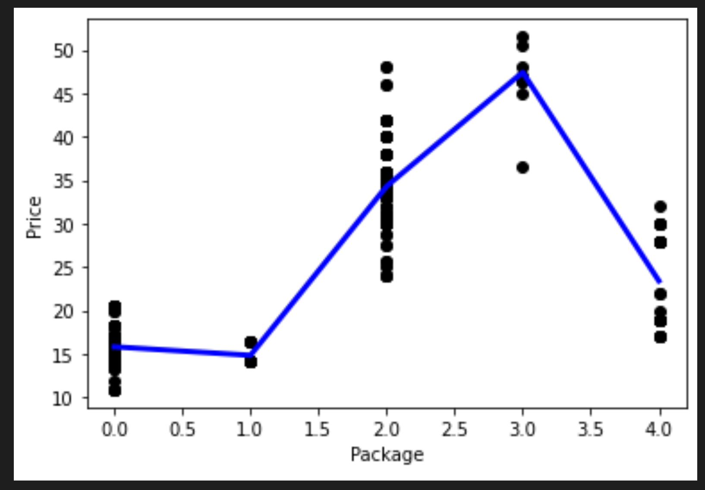

# 使用Scikit-learn构建回归模型：两种方式的回归


> 作者[Dasani Madipalli](https://twitter.com/dasani_decoded)
## [课前测](https://jolly-sea-0a877260f.azurestaticapps.net/quiz/13/)  

### 介绍 

到目前为止，你已经通过从我们将在本课程中使用的南瓜定价数据集收集的样本数据探索了什么是回归。你还使用Matplotlib对其进行了可视化。

现在你已准备好深入研究ML的回归。 在本课中，你将详细了解两种类型的回归：_基本线性回归_和_多项式回归_，以及这些技术背后的一些数学知识。 

> 在整个课程中，我们假设数学知识最少，并试图让来自其他领域的学生也能接触到它，因此请使用笔记、🧮标注、图表和其他学习工具以帮助理解。

### 前提

你现在应该熟悉我们正在检查的南瓜数据的结构。你可以在本课的_notebook.ipynb_文件中找到它。 在这个文件中，南瓜的价格显示在一个新的dataframe 中。确保可以在Visual Studio Code代码的内核中运行这些notebooks。

### 准备

提醒一下，你正在加载此数据以提出问题。

- 什么时候买南瓜最好？
- 一箱微型南瓜的价格是多少？
- 我应该买半蒲式耳还是1 1/9蒲式耳？
让我们继续深入研究这些数据。

在上一课中，你创建了一个Pandas dataframe并用原始数据集的一部分填充它，按蒲式耳标准化定价。但是，通过这样做，你只能收集大约400个数据点，而且只能收集秋季月份的数据。

看看我们在本课随附的notebook中预加载的数据。数据已预加载，并绘制了初始散点图以显示月份数据。也许我们可以通过更多地清理数据来获得更多关于数据性质的细节。 

## 线性回归线

正如你在第1课中学到的，线性回归练习的目标是能够绘制一条线以便：

- **显示变量关系**。 显示变量之间的关系
- **作出预测**。 准确预测新数据点与该线的关系。
 
绘制这种类型的线是**最小二乘回归**的典型做法。术语“最小二乘法”意味着将回归线周围的所有数据点平方，然后相加。理想情况下，最终和尽可能小，因为我们希望错误数量较少，或“最小二乘法”。

我们这样做是因为我们想要对一条与所有数据点的累积距离最小的线进行建模。我们还在添加它们之前对这些项进行平方，因为我们关心的是它的大小而不是它的方向。

> **🧮 数学知识** 
> 
> 这条线称为_最佳拟合线_，可以用[一个等式](https://en.wikipedia.org/wiki/Simple_linear_regression)表示：
> 
> ```
> Y = a + bX
> ```
>
> `X`是“解释变量”。`Y`是“因变量”。直线的斜率是`b`，`a`是y轴截距，指的是`X = 0`时`Y`的值。
>
>
>
> 首先，计算斜率`b`。作者[Jen Looper](https://twitter.com/jenlooper)
>
> 换句话说，参考我们的南瓜数据的原始问题：“按月预测每蒲式耳南瓜的价格”，`X`指的是价格，`Y`指的是销售月份。
>
>
>
> 计算Y的值。如果你支付大约4美元，那一定是四月！作者[Jen Looper](https://twitter.com/jenlooper)
>
> 计算直线的数学必须证明直线的斜率，这也取决于截距，或者当`X = 0`时`Y`所在的位置。
>
> 你可以在[Math is Fun](https://www.mathsisfun.com/data/least-squares-regression.html)网站上观察这些值的计算方法。另请访问[这个最小二乘计算器](https://www.mathsisfun.com/data/least-squares-calculator.html)以观察数字的值如何影响直线。

## 相关性

另一个需要理解的术语是给定X和Y变量之间的**相关系数**。使用散点图，你可以快速可视化该系数。数据点散布在一条直线上的图具有高相关性，但数据点散布在X和Y之间的图具有低相关性。

一个好的线性回归模型将是一个用最小二乘回归法与直线回归得到的高（更接近于1）相关系数的模型。

✅ 运行本课随附的notebook并查看City to Price散点图。根据你对散点图的视觉解释，将南瓜销售的城市与价格相关联的数据似乎具有高相关性或低相关性？

## 为回归准备数据

现在你已经了解了本练习背后的数学原理，可以创建一个回归模型，看看你是否可以预测哪个南瓜包装的南瓜价格最优惠。为节日购买南瓜的人可能希望此信息能够优化他们如何购买南瓜包装。

由于你将使用Scikit-learn，因此没有理由手动执行此操作（尽管你可以！）。在课程notebook的主要数据处理块中，从Scikit-learn添加一个库以自动将所有字符串数据转换为数字：

```python
from sklearn.preprocessing import LabelEncoder

new_pumpkins.iloc[:, 0:-1] = new_pumpkins.iloc[:, 0:-1].apply(LabelEncoder().fit_transform)
```

如果你现在查看new_pumpkins dataframe，你会看到所有字符串现在都是数字。这让你更难阅读，但对Scikit-learn来说更容易理解！

现在，你可以对最适合回归的数据做出更有根据的决策（不仅仅是基于观察散点图）。

尝试在数据的两点之间找到良好的相关性，以构建良好的预测模型。事实证明，城市和价格之间只有微弱的相关性：

```python
print(new_pumpkins['City'].corr(new_pumpkins['Price']))
0.32363971816089226
```

然而，包装和它的价格之间有更好的相关性。这是有道理的，对吧？通常，农产品箱越大，价格越高。

```python
print(new_pumpkins['Package'].corr(new_pumpkins['Price']))
0.6061712937226021
```

对这些数据提出的一个很好的问题是：“我可以期望给定的南瓜包装的价格是多少？”

让我们建立这个回归模型 

## 建立线性模型

在构建模型之前，再对数据进行一次整理。删除任何空数据并再次检查数据的样子。

```python
new_pumpkins.dropna(inplace=True)
new_pumpkins.info()
```

然后，从这个最小集合创建一个新的dataframe并将其打印出来：

```python
new_columns = ['Package', 'Price']
lin_pumpkins = new_pumpkins.drop([c for c in new_pumpkins.columns if c not in new_columns], axis='columns')

lin_pumpkins
```

```output
	Package	Price
70	0	13.636364
71	0	16.363636
72	0	16.363636
73	0	15.454545
74	0	13.636364
...	...	...
1738	2	30.000000
1739	2	28.750000
1740	2	25.750000
1741	2	24.000000
1742	2	24.000000
415 rows × 2 columns
```

1. 现在你可以分配X和y坐标数据：

   ```python
   X = lin_pumpkins.values[:, :1]
   y = lin_pumpkins.values[:, 1:2]
   ```
✅ 这里发生了什么？你正在使用[Python slice notation](https://stackoverflow.com/questions/509211/understanding-slice-notation/509295#509295)来创建数组来填充`X`和`y`。

2. 接下来，开始回归模型构建例程：

   ```python
   from sklearn.linear_model import LinearRegression
   from sklearn.metrics import r2_score, mean_squared_error, mean_absolute_error
   from sklearn.model_selection import train_test_split

   X_train, X_test, y_train, y_test = train_test_split(X, y, test_size=0.2, random_state=0)
   lin_reg = LinearRegression()
   lin_reg.fit(X_train,y_train)

   pred = lin_reg.predict(X_test)

   accuracy_score = lin_reg.score(X_train,y_train)
   print('Model Accuracy: ', accuracy_score)
   ```

   因为相关性不是特别好，所以生成的模型不是非常准确。

   ```output
   Model Accuracy:  0.3315342327998987
   ```

3. 你可以将过程中绘制的线条可视化：

   ```python
   plt.scatter(X_test, y_test,  color='black')
   plt.plot(X_test, pred, color='blue', linewidth=3)

   plt.xlabel('Package')
   plt.ylabel('Price')

   plt.show()
   ```
   

4. 针对假设的品种测试模型：

   ```python
   lin_reg.predict( np.array([ [2.75] ]) )
   ```
   
   这个神话般的品种的价格是：

   ```output
   array([[33.15655975]])
   ```

如果回归线的逻辑成立，这个数字是有意义的。

🎃 恭喜你，你刚刚创建了一个模型，可以帮助预测几个南瓜品种的价格。你的节日南瓜地会很漂亮的。但是你可以创造一个更好的模型！

## 多项式回归

另一种线性回归是多项式回归。虽然有时变量之间存在线性关系——南瓜的体积越大，价格就越高——但有时这些关系不能绘制成平面或直线。

✅ 这里有可以使用多项式回归数据的[更多示例](https://online.stat.psu.edu/stat501/lesson/9/9.8)

再看一下上图中品种与价格之间的关系。这个散点图看起来是否应该用一条直线来分析？也许不是。在这种情况下，你可以尝试多项式回归。

✅ 多项式是可能由一个或多个变量和系数组成的数学表达式

多项式回归创建一条曲线以更好地拟合非线性数据。

1. 让我们重新创建一个填充了原始南瓜数据片段的dataframe：
   ```python
   new_columns = ['Variety', 'Package', 'City', 'Month', 'Price']
   poly_pumpkins = new_pumpkins.drop([c for c in new_pumpkins.columns if c not in new_columns], axis='columns')

   poly_pumpkins
   ```

可视化dataframe中数据之间相关性的一种好方法是将其显示在“coolwarm”图表中：

2. 使用`Background_gradient()`方法和`coolwarm`作为其参数值：

   ```python
   corr = poly_pumpkins.corr()
   corr.style.background_gradient(cmap='coolwarm')
   ```
   这段代码创建了一个热图:
   

查看此图表，你可以直观地看到Package和Price之间的良好相关性。所以你应该能够创建一个比上一个更好的模型。

### 创建管道

Scikit-learn包含一个用于构建多项式回归模型的有用API - `make_pipeline` [API](https://scikit-learn.org/stable/modules/generated/sklearn.pipeline.make_pipeline.html?highlight=pipeline#sklearn.pipeline.make_pipeline)。 创建了一个“管道”，它是一个估计器链。 在这种情况下，管道包括多项式特征或形成非线性路径的预测。

1. 构建X和y列：

   ```python
   X=poly_pumpkins.iloc[:,3:4].values
   y=poly_pumpkins.iloc[:,4:5].values
   ```

2. 通过调用`make_pipeline()`方法创建管道：

   ```python
   from sklearn.preprocessing import PolynomialFeatures
   from sklearn.pipeline import make_pipeline

   pipeline = make_pipeline(PolynomialFeatures(4), LinearRegression())

   X_train, X_test, y_train, y_test = train_test_split(X, y, test_size=0.2, random_state=0)

   pipeline.fit(np.array(X_train), y_train)

   y_pred=pipeline.predict(X_test)
   ```

### 创建序列

此时，你需要使用_排序好的_数据创建一个新的dataframe ，以便管道可以创建序列。

添加以下代码：

   ```python
   df = pd.DataFrame({'x': X_test[:,0], 'y': y_pred[:,0]})
   df.sort_values(by='x',inplace = True)
   points = pd.DataFrame(df).to_numpy()

   plt.plot(points[:, 0], points[:, 1],color="blue", linewidth=3)
   plt.xlabel('Package')
   plt.ylabel('Price')
   plt.scatter(X,y, color="black")
   plt.show()
   ```

你通过调用`pd.DataFrame`创建了一个新的dataframe。然后通过调用`sort_values()`对值进行排序。最后你创建了一个多项式图：



你可以看到更适合你的数据的曲线。

让我们检查模型的准确性：

   ```python
   accuracy_score = pipeline.score(X_train,y_train)
   print('Model Accuracy: ', accuracy_score)
   ```

   瞧！

   ```output
   Model Accuracy:  0.8537946517073784
   ```

这样好多了！试着预测一个价格：

### 做个预测

我们可以输入一个新值并得到一个预测吗？

调用`predict()`进行预测：
 
   ```python
   pipeline.predict( np.array([ [2.75] ]) )
   ```
   你会得到这样的预测：

   ```output
   array([[46.34509342]])
   ```

参照图像，这确实有道理！而且，如果这是一个比前一个更好的模型，看同样的数据，你需要为这些更昂贵的南瓜做好预算！

🏆 干得不错！你在一节课中创建了两个回归模型。在回归的最后一节中，你将了解逻辑回归以确定类别。 

---
## 🚀挑战

在此notebook中测试几个不同的变量，以查看相关性与模型准确性的对应关系。

## [课后测](https://jolly-sea-0a877260f.azurestaticapps.net/quiz/14/)

## 复习与自学

在本课中，我们学习了线性回归。还有其他重要的回归类型。了解Stepwise、Ridge、Lasso和Elasticnet技术。学习更多信息的好课程是[斯坦福统计学习课程](https://online.stanford.edu/courses/sohs-ystatslearning-statistical-learning)

## 任务 

[构建模型](assignment.md)
