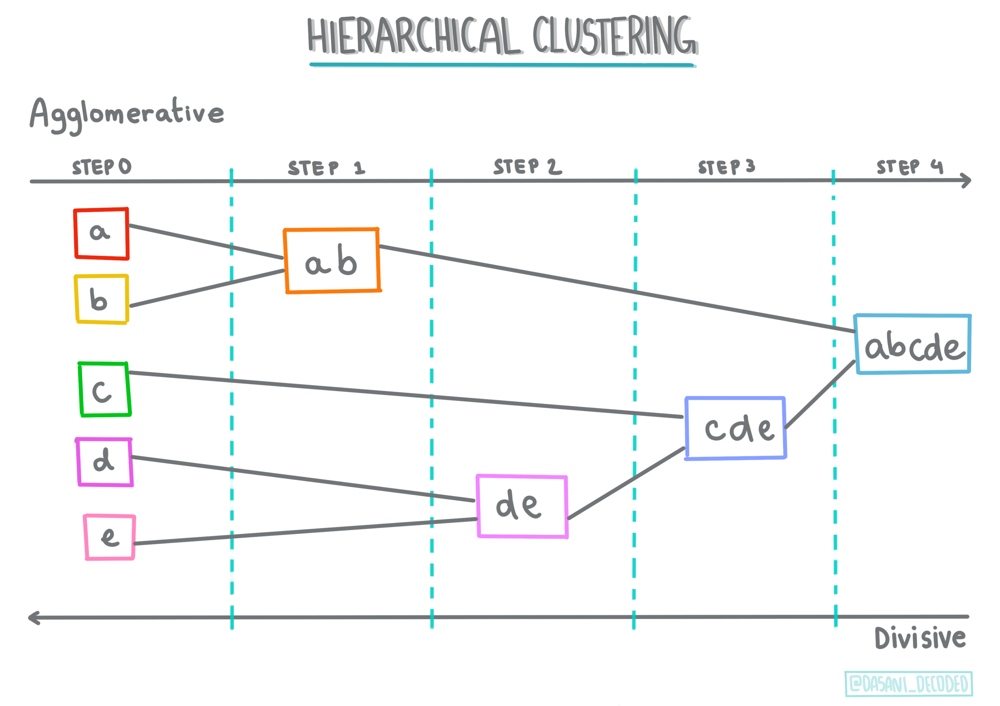
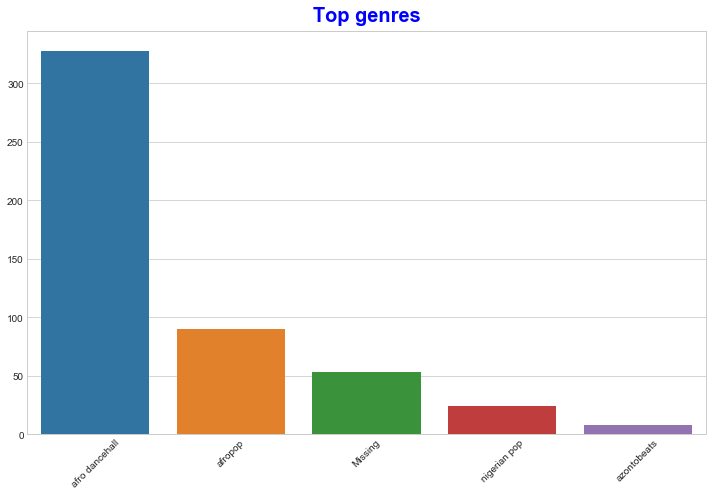
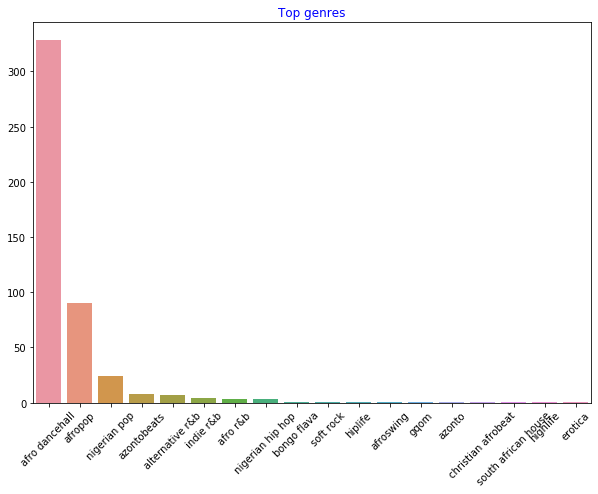
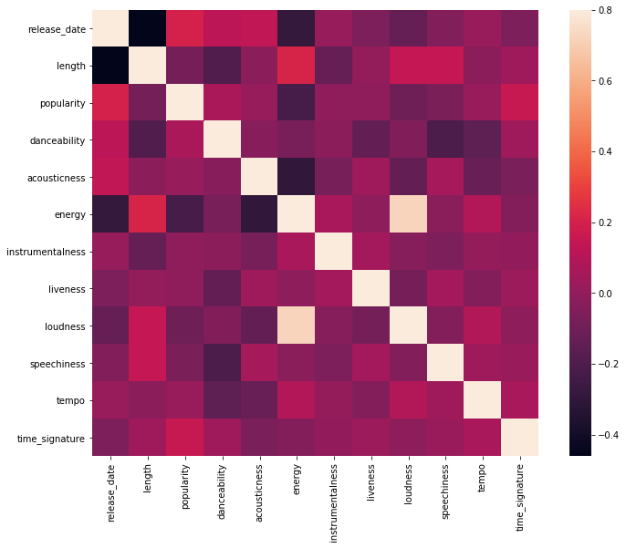
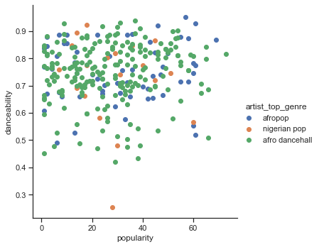

# 介绍聚类

聚类是一种无监督学习，它假定数据集未标记或其输入与预定义的输出不匹配。它使用各种算法对未标记的数据进行排序，并根据它在数据中识别的模式提供分组。
[](https://youtu.be/ty2advRiWJM "No One Like You by PSquare")

> 🎥 点击上面的图片观看视频。当您通过聚类学习机器学习时，请欣赏一些尼日利亚舞厅曲目 - 这是2014 年PSquare上高度评价的歌曲。
## [课前测验](https://jolly-sea-0a877260f.azurestaticapps.net/quiz/27/)
### 介绍

[聚类](https://link.springer.com/referenceworkentry/10.1007%2F978-0-387-30164-8_124)对于数据探索非常有用。让我们看看它是否有助于发现尼日利亚观众消费音乐的趋势和模式。

✅花一点时间思考聚类的用途。在现实生活中，每当你有一堆衣服需要整理家人的衣服时，就会发生聚类🧦👕👖🩲. 在数据科学中，聚类用于在尝试分析用户的偏好或确定任何未标记数据集的特征。在某种程度上，聚类有助于理解杂乱的状态，就像是一个袜子抽屉。

[](https://youtu.be/esmzYhuFnds "Introduction to Clustering")

> 🎥单击上图观看视频：麻省理工学院的 John Guttag 介绍聚类

在专业环境中，聚类可用于确定诸如市场细分之类的事情，例如确定哪些年龄组购买哪些商品。另一个用途是异常检测，可能是从信用卡交易数据集中检测欺诈。或者您可以使用聚类来确定一批医学扫描中的肿瘤。

✅ 想一想您是如何在银行、电子商务或商业环境中“意外”遇到聚类的。

> 🎓有趣的是，聚类分析起源于 1930 年代的人类学和心理学领域。你能想象它是如何被使用的吗？

或者，您可以使用它对搜索结果进行分组 - 例如，通过购物链接、图片或评论。当您有一个大型数据集想要减少并且想要对其执行更细粒度的分析时，聚类非常有用，因此该技术可用于在构建其他模型之前了解数据。

✅一旦你的数据被组织成聚类，你就为它分配一个聚类 ID，这个技术在保护数据集的隐私时很有用；您可以改为通过其聚类 ID 来引用数据点，而不是通过更多的可明显区分的数据。您能想到为什么要引用聚类 ID 而不是聚类的其他元素来识别它的其他原因吗？

在此[学习模块中](https://docs.microsoft.com/learn/modules/train-evaluate-cluster-models?WT.mc_id=academic-15963-cxa)加深您对聚类技术的理解

## 聚类入门

[Scikit-learn ](https://scikit-learn.org/stable/modules/clustering.html)提供了大量的方法来执行聚类。您选择的类型将取决于您的用例。根据文档，每种方法都有不同的好处。以下是 Scikit-learn 支持的方法及其适当用例的简化表：

| 方法名称                     | 用例                                               |
| ---------------------------- | -------------------------------------------------- |
| K-Means                      | 通用目的，归纳的                                   |
| Affinity propagation         | 许多，不均匀的聚类，归纳的                         |
| Mean-shift                   | 许多，不均匀的聚类，归纳的                         |
| Spectral clustering          | 少数，甚至聚类，转导的                             |
| Ward hierarchical clustering | 许多，受约束的聚类，转导的                         |
| Agglomerative clustering     | 许多，受约束的，非欧几里得距离，转导的             |
| DBSCAN                       | 非平面几何，不均匀聚类，转导的                     |
| OPTICS                       | 不平坦的几何形状，具有可变密度的不均匀聚类，转导的 |
| Gaussian mixtures            | 平面几何，归纳的                                   |
| BIRCH                        | 具有异常值的大型数据集，归纳的                     |

> 🎓我们如何创建聚类与我们如何将数据点收集到组中有很大关系。让我们分析一些词汇：
>
> 🎓 [“转导”与“归纳”](https://wikipedia.org/wiki/Transduction_(machine_learning))
>
> 转导推理源自观察到的映射到特定测试用例的训练用例。归纳推理源自映射到一般规则的训练案例，然后才应用于测试案例。
>
> 示例：假设您有一个仅部分标记的数据集。有些东西是“记录”，有些是“CD”，有些是空白的。您的工作是为空白提供标签。如果您选择归纳方法，您将训练一个寻找“记录”和“CD”的模型，并将这些标签应用于未标记的数据。这种方法将难以对实际上是“盒式磁带”的东西进行分类。另一方面，转导方法可以更有效地处理这些未知数据，因为它可以将相似的项目组合在一起，然后将标签应用于一个组。在这种情况下，聚类可能反映“圆形音乐事物”和“方形音乐事物”。
>
> 🎓 [“非平面”与“平面”几何](https://datascience.stackexchange.com/questions/52260/terminology-flat-geometry-in-the-context-of-clustering)
>
> 源自数学术语，非平面与平面几何是指通过“平面”（[欧几里德](https://wikipedia.org/wiki/Euclidean_geometry)）或“非平面”（非欧几里得）几何方法测量点之间的距离。
>
> 在此上下文中，“平面”是指欧几里得几何（其中一部分被教导为“平面”几何），而非平面是指非欧几里得几何。几何与机器学习有什么关系？好吧，作为植根于数学的两个领域，必须有一种通用的方法来测量聚类中点之间的距离，并且可以以“平坦”(flat)或“非平坦”(non-flat)的方式完成，具体取决于数据的性质. [欧几里得距离](https://wikipedia.org/wiki/Euclidean_distance)测量为两点之间线段的长度。[非欧距离](https://wikipedia.org/wiki/Non-Euclidean_geometry)是沿曲线测量的。如果您的可视化数据似乎不存在于平面上，您可能需要使用专门的算法来处理它。
>
> 
> [Dasani Madipalli ](https://twitter.com/dasani_decoded)作图
>
> 🎓 ['距离'](https://web.stanford.edu/class/cs345a/slides/12-clustering.pdf)
>
> 聚类由它们的距离矩阵定义，例如点之间的距离。这个距离可以通过几种方式来测量。欧几里得聚类由点值的平均值定义，并包含“质心”或中心点。因此，距离是通过到该质心的距离来测量的。非欧式距离指的是“聚类中心”，即离其他点最近的点。聚类中心又可以用各种方式定义。
>
> 🎓 ['约束'](https://wikipedia.org/wiki/Constrained_clustering)
>
> [约束聚类](https://web.cs.ucdavis.edu/~davidson/Publications/ICDMTutorial.pdf)将“半监督”学习引入到这种无监督方法中。点之间的关系被标记为“无法链接”或“必须链接”，因此对数据集强加了一些规则。
>
> 一个例子：如果一个算法在一批未标记或半标记的数据上不受约束，它产生的聚类质量可能很差。在上面的示例中，聚类可能将“圆形音乐事物”和“方形音乐事物”以及“三角形事物”和“饼干”分组。如果给出一些约束或要遵循的规则（“物品必须由塑料制成”、“物品需要能够产生音乐”），这可以帮助“约束”算法做出更好的选择。
>
> 🎓 '密度'
>
> “嘈杂”的数据被认为是“密集的”。在检查时，每个聚类中的点之间的距离可能或多或少地密集或“拥挤”，因此需要使用适当的聚类方法分析这些数据。[本文](https://www.kdnuggets.com/2020/02/understanding-density-based-clustering.html)演示了使用 K-Means 聚类与 HDBSCAN 算法探索具有不均匀聚类密度的嘈杂数据集之间的区别。

## 聚类算法

有超过 100 种聚类算法，它们的使用取决于手头数据的性质。让我们讨论一些主要的：

- **层次聚类**。如果一个对象是根据其与附近对象的接近程度而不是较远对象来分类的，则聚类是根据其成员与其他对象之间的距离来形成的。Scikit-learn 的凝聚聚类是分层的。

   

   > [Dasani Madipalli ](https://twitter.com/dasani_decoded)作图

- **质心聚类**。这种流行的算法需要选择“k”或要形成的聚类数量，然后算法确定聚类的中心点并围绕该点收集数据。[K-means 聚类](https://wikipedia.org/wiki/K-means_clustering)是质心聚类的流行版本。中心由最近的平均值确定，因此叫做质心。与聚类的平方距离被最小化。

   

   > [Dasani Madipalli](https://twitter.com/dasani_decoded)作图

- **基于分布的聚类**。基于统计建模，基于分布的聚类中心确定一个数据点属于一个聚类的概率，并相应地分配它。高斯混合方法属于这种类型。

- **基于密度的聚类**。数据点根据它们的密度或它们彼此的分组分配给聚类。远离该组的数据点被视为异常值或噪声。DBSCAN、Mean-shift 和 OPTICS 属于此类聚类。

- **基于网格的聚类**。对于多维数据集，创建一个网格并将数据划分到网格的单元格中，从而创建聚类。


## 练习 - 对你的数据进行聚类

适当的可视化对聚类作为一种技术有很大帮助，所以让我们从可视化我们的音乐数据开始。这个练习将帮助我们决定我们应该最有效地使用哪种聚类方法来处理这些数据的性质。

1. 打开此文件夹中的*notebook.ipynb*文件。

1. 导入`Seaborn`包以获得良好的数据可视化。

    ```python
    !pip install seaborn
    ```

1. 附加来自*nigerian-songs.csv*的歌曲数据。加载包含有关歌曲的一些数据的数据帧。准备好通过导入库和转储数据来探索这些数据：

    ```python
    import matplotlib.pyplot as plt
    import pandas as pd
    
    df = pd.read_csv("../data/nigerian-songs.csv")
    df.head()
    ```

    检查前几行数据：

    |     | name                     | album                        | artist              | artist_top_genre | release_date | length | popularity | danceability | acousticness | energy | instrumentalness | liveness | loudness | speechiness | tempo   | time_signature |
    | --- | ------------------------ | ---------------------------- | ------------------- | ---------------- | ------------ | ------ | ---------- | ------------ | ------------ | ------ | ---------------- | -------- | -------- | ----------- | ------- | -------------- |
    | 0   | Sparky                   | Mandy & The Jungle           | Cruel Santino       | alternative r&b  | 2019         | 144000 | 48         | 0.666        | 0.851        | 0.42   | 0.534            | 0.11     | -6.699   | 0.0829      | 133.015 | 5              |
    | 1   | shuga rush               | EVERYTHING YOU HEARD IS TRUE | Odunsi (The Engine) | afropop          | 2020         | 89488  | 30         | 0.71         | 0.0822       | 0.683  | 0.000169         | 0.101    | -5.64    | 0.36        | 129.993 | 3              |
    | 2   | LITT!                    | LITT!                        | AYLØ                | indie r&b        | 2018         | 207758 | 40         | 0.836        | 0.272        | 0.564  | 0.000537         | 0.11     | -7.127   | 0.0424      | 130.005 | 4              |
    | 3   | Confident / Feeling Cool | Enjoy Your Life              | Lady Donli          | nigerian pop     | 2019         | 175135 | 14         | 0.894        | 0.798        | 0.611  | 0.000187         | 0.0964   | -4.961   | 0.113       | 111.087 | 4              |
    | 4   | wanted you               | rare.                        | Odunsi (The Engine) | afropop          | 2018         | 152049 | 25         | 0.702        | 0.116        | 0.833  | 0.91             | 0.348    | -6.044   | 0.0447      | 105.115 | 4              |

1. 获取有关数据帧的一些信息，调用`info()`：

    ```python
    df.info()
    ```

   输出看起来像这样：

    ```output
    <class 'pandas.core.frame.DataFrame'>
    RangeIndex: 530 entries, 0 to 529
    Data columns (total 16 columns):
     #   Column            Non-Null Count  Dtype  
    ---  ------            --------------  -----  
     0   name              530 non-null    object 
     1   album             530 non-null    object 
     2   artist            530 non-null    object 
     3   artist_top_genre  530 non-null    object 
     4   release_date      530 non-null    int64  
     5   length            530 non-null    int64  
     6   popularity        530 non-null    int64  
     7   danceability      530 non-null    float64
     8   acousticness      530 non-null    float64
     9   energy            530 non-null    float64
     10  instrumentalness  530 non-null    float64
     11  liveness          530 non-null    float64
     12  loudness          530 non-null    float64
     13  speechiness       530 non-null    float64
     14  tempo             530 non-null    float64
     15  time_signature    530 non-null    int64  
    dtypes: float64(8), int64(4), object(4)
    memory usage: 66.4+ KB
    ```

1. 通过调用`isnull()`和验证总和为 0 来仔细检查空值：

    ```python
    df.isnull().sum()
    ```

    看起来不错：

    ```output
    name                0
    album               0
    artist              0
    artist_top_genre    0
    release_date        0
    length              0
    popularity          0
    danceability        0
    acousticness        0
    energy              0
    instrumentalness    0
    liveness            0
    loudness            0
    speechiness         0
    tempo               0
    time_signature      0
    dtype: int64
    ```

1. 描述数据：

    ```python
    df.describe()
    ```

    |       | release_date | length      | popularity | danceability | acousticness | energy   | instrumentalness | liveness | loudness  | speechiness | tempo      | time_signature |
    | ----- | ------------ | ----------- | ---------- | ------------ | ------------ | -------- | ---------------- | -------- | --------- | ----------- | ---------- | -------------- |
    | count | 530          | 530         | 530        | 530          | 530          | 530      | 530              | 530      | 530       | 530         | 530        | 530            |
    | mean  | 2015.390566  | 222298.1698 | 17.507547  | 0.741619     | 0.265412     | 0.760623 | 0.016305         | 0.147308 | -4.953011 | 0.130748    | 116.487864 | 3.986792       |
    | std   | 3.131688     | 39696.82226 | 18.992212  | 0.117522     | 0.208342     | 0.148533 | 0.090321         | 0.123588 | 2.464186  | 0.092939    | 23.518601  | 0.333701       |
    | min   | 1998         | 89488       | 0          | 0.255        | 0.000665     | 0.111    | 0                | 0.0283   | -19.362   | 0.0278      | 61.695     | 3              |
    | 25%   | 2014         | 199305      | 0          | 0.681        | 0.089525     | 0.669    | 0                | 0.07565  | -6.29875  | 0.0591      | 102.96125  | 4              |
    | 50%   | 2016         | 218509      | 13         | 0.761        | 0.2205       | 0.7845   | 0.000004         | 0.1035   | -4.5585   | 0.09795     | 112.7145   | 4              |
    | 75%   | 2017         | 242098.5    | 31         | 0.8295       | 0.403        | 0.87575  | 0.000234         | 0.164    | -3.331    | 0.177       | 125.03925  | 4              |
    | max   | 2020         | 511738      | 73         | 0.966        | 0.954        | 0.995    | 0.91             | 0.811    | 0.582     | 0.514       | 206.007    | 5              |

> 🤔如果我们正在使用聚类，一种不需要标记数据的无监督方法，为什么我们用标签显示这些数据？在数据探索阶段，它们派上用场，但它们不是聚类算法工作所必需的。您也可以删除列标题并按列号引用数据。

查看数据的普遍值。请注意，流行度可以是“0”，表示没有排名的歌曲。让我们尽快删除它们。

1. 使用条形图找出最受欢迎的类型：

    ```python
    import seaborn as sns
    
    top = df['artist_top_genre'].value_counts()
    plt.figure(figsize=(10,7))
    sns.barplot(x=top[:5].index,y=top[:5].values)
    plt.xticks(rotation=45)
    plt.title('Top genres',color = 'blue')
    ```

    

✅如果您想查看更多顶部值，请将顶部更改`[:5]`为更大的值，或将其删除以查看全部。

请注意，当顶级流派被描述为“缺失”时，这意味着 Spotify 没有对其进行分类，所以让我们避免它。

1. 通过过滤掉丢失的数据来避免

    ```python
    df = df[df['artist_top_genre'] != 'Missing']
    top = df['artist_top_genre'].value_counts()
    plt.figure(figsize=(10,7))
    sns.barplot(x=top.index,y=top.values)
    plt.xticks(rotation=45)
    plt.title('Top genres',color = 'blue')
    ```

    现在重新检查genres：

    

1. 到目前为止，前三大流派主导了这个数据集。让我们专注于`afro dancehall`, `afropop`, 和`nigerian pop`，另外过滤数据集以删除任何具有 0 流行度值的内容（这意味着它在数据集中没有被归类为流行度并且可以被视为我们的目的的噪音）：

    ```python
    df = df[(df['artist_top_genre'] == 'afro dancehall') | (df['artist_top_genre'] == 'afropop') | (df['artist_top_genre'] == 'nigerian pop')]
    df = df[(df['popularity'] > 0)]
    top = df['artist_top_genre'].value_counts()
    plt.figure(figsize=(10,7))
    sns.barplot(x=top.index,y=top.values)
    plt.xticks(rotation=45)
    plt.title('Top genres',color = 'blue')
    ```

1. 做一个快速测试，看看数据是否以任何特别强的方式相关：

    ```python
    corrmat = df.corr()
    f, ax = plt.subplots(figsize=(12, 9))
    sns.heatmap(corrmat, vmax=.8, square=True)
    ```

    

    > 唯一强相关性是`energy`和之间`loudness`，这并不奇怪，因为嘈杂的音乐通常非常有活力。否则，相关性相对较弱。看看聚类算法可以如何处理这些数据会很有趣。
    >
    > > 🎓请注意，相关性并不意味着因果关系！我们有相关性的证据，但没有因果关系的证据。一个[有趣的网站](https://tylervigen.com/spurious-correlations)有一些强调这一点的视觉效果。

这个数据集是否围绕歌曲的流行度和可舞性有任何收敛？FacetGrid 显示无论流派如何，都有同心圆排列。对于这种类型，尼日利亚人的口味是否会在某种程度的可舞性上趋于一致？

✅尝试不同的数据点（能量、响度、语音）和更多或不同的音乐类型。你能发现什么？查看`df.describe()`表格以了解数据点的一般分布。

### 练习 - 数据分布

这三种流派是否因其受欢迎程度而对其可舞性的看法有显着差异？

1. 检查我们沿给定 x 和 y 轴的流行度和可舞性的前三种类型数据分布。

    ```python
    sns.set_theme(style="ticks")
    
    g = sns.jointplot(
        data=df,
        x="popularity", y="danceability", hue="artist_top_genre",
        kind="kde",
    )
    ```

    您可以发现围绕一般收敛点的同心圆，显示点的分布。

    > 🎓请注意，此示例使用 KDE（核密度估计）图，该图使用连续概率密度曲线表示数据。这允许我们在处理多个分布时解释数据。

    总的来说，这三种流派在流行度和可舞性方面松散地对齐。在这种松散对齐的数据中确定聚类将是一个挑战：

    

1. 创建散点图：

    ```python
    sns.FacetGrid(df, hue="artist_top_genre", size=5) \
       .map(plt.scatter, "popularity", "danceability") \
       .add_legend()
    ```

    相同轴的散点图显示了类似的收敛模式

    

一般来说，对于聚类，你可以使用散点图来展示数据的聚类，所以掌握这种类型的可视化是非常有用的。在下一课中，我们将使用过滤后的数据并使用 k-means 聚类来发现这些数据中以有趣方式重叠的组。

---

## 🚀挑战

为下一课做准备，制作一张图表，说明您可能会在生产环境中发现和使用的各种聚类算法。

聚类试图解决什么样的问题？

## [课后测验](https://jolly-sea-0a877260f.azurestaticapps.net/quiz/28/)

## 复习与自学

在应用聚类算法之前，正如我们所了解的，了解数据集的性质是一个好主意。[在此处](https://www.kdnuggets.com/2019/10/right-clustering-algorithm.html)阅读有关此主题的更多[信息](https://www.kdnuggets.com/2019/10/right-clustering-algorithm.html)

[这篇有用的文章将](https://www.freecodecamp.org/news/8-clustering-algorithms-in-machine-learning-that-all-data-scientists-should-know/)引导您了解各种聚类算法在给定不同数据形状的情况下的不同行为方式。

## 作业

[研究用于聚类的其他可视化](./assignment.md)
