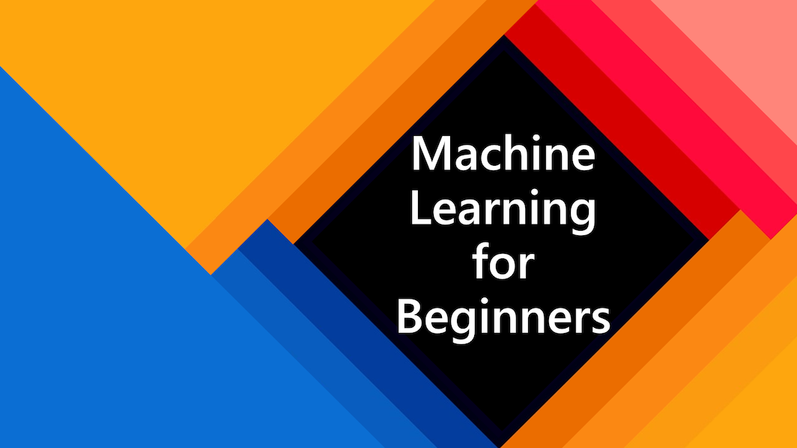

本来是想自己一边学习一遍翻译，后来发现自己翻译太慢了，同时也看到官网也一直在翻译（但我发现官网的翻译不是很好，不过也能看的懂）。所以我就把官方仓储里的翻译内容整合到我自己的repo了，给后续寻找中文翻译的小伙伴们一个便利。

|    课程序号   |                  主题                        |                   学习内容                                |                     完成情况                                  |  
| :-----------: | :-----------------------------------------: | :--------------------------------------------------------: | :---------------------------------------------------: |  
|      01       |                机器学习介绍                  |   学习机器学习的基本概念                                     |  视频已迁移B站（无字幕）
|      02       |                机器学习历史                  |   学习机器学习的历史                                         |  视频已迁移B站（无字幕）
|      03       |                机器学习和公平                |   在构建和应用ML模型时，围绕公平的重要哲学问题是什么  ?      |  
|      04       |                机器学习用到的技术            |   构建机器学习模型需要什么技术?                              | 
|      05       |                   回归介绍                   |  通过Python和Scikit-learn学习回归模型                        |  
|      06       |                北美南瓜价格 🎃              |  在机器学习准备过程汇总的数据清理和可视化                     |
|      07       |                北美南瓜价格 🎃              |  构建线性和多项式回归模型                                     |     
|      08       |                北美南瓜价格 🎃              |  构建逻辑回归模型                                             |  
|      09       |                   web应用 🔌                |  为已经训练的模型创建网页应用                                 | 
|      10       |                 分类介绍                    | 清理、准备和可视化数据; 介绍分类                             |  
|      11       |             美味的亚洲和印度菜 🍜           |  分类器介绍                                                   |
|      12       |             美味的亚洲和印度菜 🍜          |  更多分类器                                                   |
|      13       |             美味的亚洲和印度菜 🍜          |  用你的模型来创建一个推荐网站                                 | 
|      14       |                   聚类介绍                  |  清理、准备和可视化数据；介绍聚类                             |  
|      15       |              探索尼日利亚音乐品味 🎧       |  探索K-Means 聚类方法                                          |      
|      16       |        自然语言处理介绍 ☕️                 |  通过构建一个简单的机器人来了解NLP的基本概念                      |      
|      17       |                      常用NLP任务 ☕️        |  通过理解处理语言结构时所需的常见任务来加深你的自然语言处理知识   |            
|      18       |             翻译和情感分析 ♥️               |   简·奥斯汀的翻译和情感分析                                       | 
|      19       |                 欧洲浪漫酒店 ♥️             |   对酒店评论进行情感分析 1                                        |    
|      20       |                  欧洲浪漫酒店 ♥️            |  对酒店评论进行情感分析 2                                          |     
|      21       |            时间序列预测导论                |              时间序列预测介绍                                       |  
|      22       | ⚡️ 世界能源使用 ⚡️ - ARIMA时间序列预测     |        ARIMA时间序列预测                                           |      
|      23       |             强化学习介绍                   |  Q-Learning强化学习导论                                            |   
|      24       |                 帮助彼得躲避狼 🐺          |  Gym 强化学习                                                     |    
|  Postscript   |      真实人工智能（ML）场景以及应用         |     经典机器学习在真实世界中的应用                                |                               |

********
# 面向初学者的机器学习课程

> 🌍 通过世界文化探索机器学习，周游世界 🌍

这是一份有微软Azure云提供的机器学习课程，课程时长12周、包含24课时。在这份课程里，我们将避开深度学习的内容，使用Scikit-learn这个工具来学习所谓的“经典机器学习”算法。同样，我们还有一门兄弟课程“面向初学者的数据科学”。

就像环游世界一样，这门课程的数据采自全世界各地。同时，每一节课程都有一个课前和课后测试，包含了课程的介绍、具体内容以及课后作业等等。课程基于项目实践的方式进行教学，者被证明是一种有效的学习方式。

**✍️ 重点感谢我们的作者** Jen Looper, Stephen Howell, Francesca Lazzeri, Tomomi Imura, Cassie Breviu, Dmitry Soshnikov, Chris Noring, Ornella Altunyan, and Amy Boyd

**🎨 同样感谢我们的内容插画作者** Tomomi Imura, Dasani Madipalli, and Jen Looper

**🙏 同样感谢微软的学生代表作者，审核人以及内容贡献者 🙏 **, 尤其是 Rishit Dagli, Muhammad Sakib Khan Inan, Rohan Raj, Alexandru Petrescu, Abhishek Jaiswal, Nawrin Tabassum, Ioan Samuila, and Snigdha Agarwal

**🤩 特别感谢微软学生代表Eric Wanjau为我们提供的R课程!** 

---

# 从这里开始

**作为学生**, fork整个repo到自己的github账号里，自己活着和团队协作完成里边的练习:

- 完成课前测试。
- 阅读课程内容，并及时停下来思考、检测自己已经学习的内容。
- 课程代码都在每个项目的'/solution'文件夹下，但是我们还是建议所有人在理解的基础上自己创建工程来实践，而不是直接运行现有的代码。
- 完成课后测试。
- 完成挑战。
- 完成作业。
- 当完成课程后，访问 [Discussion board](https://github.com/microsoft/ML-For-Beginners/discussions)并通过PAT标注记录当前学习情况（此块不准确）。 我们通过填写PAT这个表格，来完成我们学习的评估。当然我们参与到其他的PAT中，从而可以和其他人一块学习。

> 进一步的学习，我们推荐您查看 [Microsoft Learn](https://docs.microsoft.com/en-us/users/jenlooper-2911/collections/k7o7tg1gp306q4?WT.mc_id=academic-15963-cxa) 的内容和学习路径

**作为老师**, 请查阅 [included some suggestions](for-teachers.md)。

---

## 开发团队

> 🎥 点击上面的图片查看关于这个项目和创建者的视频。

---

## 教学策略

在保证教程具有很深的聚焦性的基础上，教程还有两个重要的学习理念，分别为确保你真正的参与到项目实操以及频繁的测验。

通过确保内容与项目一致，这个过程对学生来说更有吸引力，概念的留存也会增强。 这个课程设计灵活、有趣，可以全部或部分学习。 项目开始时很小，在12周周期结束时变得越来越复杂。   

为了让学习更有吸引力，同时学完后概念能记得更深刻，课程的内容在设计上和项目是一致的。 此外，课前的小测验可以确定学生学习某一主题的意图，而课后的小测验则可以确保进一步的记忆。本课程还包括一个关于ML的实际应用的后记，可以学有余力的学生继续学习的基础。

> 可以在[规范](CODE_OF_CONDUCT.md)、[提交贡献](CONTRIBUTING.md)以及[参与翻译](TRANSLATIONS.md)这三个连接找到你对应感兴趣的内容，欢迎随时提供反馈。

## 每节课的包含内容:

- （可选）sketchnote
- （可选）视频
- 课前小测试
- 编写课程
- 对于基于项目的课程，将逐步指导如何构建项目
- 知识点检查
- 一个小挑战
- 补充阅读
- 作业
- 课后测试

> **关于小测试**: 所有的小测试都在这个[网站](https://jolly-sea-0a877260f.azurestaticapps.net)上, 共50个测试，每个测试包含三道题目。 这些测试的连接都包含在课程中，当然你也可以通过在本地文件夹"quiz-app"文件夹里操作说明在本地运行查看。

|    课程序号   |                              主题                              |                   可分租                            | 学习目标                                                                                                                  |                     课程链接                        |    作者                 |
| :-----------: | :------------------------------------------------------------: | :-------------------------------------------------: | ------------------------------------------------------------------------------------------------------------------------------- | :---------------------------------------------------: | :------------: |
|      01       |                机器学习介绍                                    |      [介绍](1-Introduction/README.md)       |学习机器学习的基本概念                                                                                |   [lesson](1-Introduction/1-intro-to-ML/README.md)    |    Muhammad    |
|      02       |                机器学习历史                                    |      [介绍](1-Introduction/README.md)       | 学习机器学习的历史                                                                                         |  [lesson](1-Introduction/2-history-of-ML/README.md)   |  Jen and Amy   |
|      03       |                机器学习和公平                                  |      [介绍](1-Introduction/README.md)       | 在构建和应用ML模型时，围绕公平的重要哲学问题是什么  ? |     [lesson](1-Introduction/3-fairness/README.md)     |     Tomomi     |
|      04       |                机器学习用到的技术                              |      [介绍](1-Introduction/README.md)       | 构建机器学习模型需要什么技术?                                                                       | [lesson](1-Introduction/4-techniques-of-ML/README.md) | Chris and Jen  |
|      05       |                   回归介绍                                     |        [回归](2-Regression/README.md)         |通过Python和Scikit-learn学习回归模型                                                                  |       [lesson](2-Regression/1-Tools/README.md)        |      Jen       |
|      06       |                北美南瓜价格 🎃                                 |        [回归](2-Regression/README.md)         | 在机器学习准备过程汇总的数据清理和可视化                                                                                  |        [lesson](2-Regression/2-Data/README.md)        |      Jen       |
|      07       |                北美南瓜价格 🎃                                 |        [回归](2-Regression/README.md)         | 构建线性和多项式回归模型                                                                                   |       [lesson](2-Regression/3-Linear/README.md)       |      Jen       |
|      08       |                北美南瓜价格 🎃                                 |        [回归](2-Regression/README.md)         | 构建逻辑回归模型                                                                                               |      [lesson](2-Regression/4-Logistic/README.md)      |      Jen       |
|      09       |                          web应用 🔌                            |           [web应用](3-Web-App/README.md)            | 为已经训练的模型创建网页应用                                                                                       |        [lesson](3-Web-App/1-Web-App/README.md)        |      Jen       |
|      10       |                 分类介绍                                        |    [分类](4-Classification/README.md)     |清理、准备和可视化数据; 介绍分类                                                              |  [lesson](4-Classification/1-Introduction/README.md)  | Jen and Cassie |
|      11       |             美味的亚洲和印度菜 🍜                              |    [分类](4-Classification/README.md)     | 分类器介绍                                                                                                     | [lesson](4-Classification/2-Classifiers-1/README.md)  | Jen and Cassie |
|      12       |             美味的亚洲和印度菜 🍜                              |    [分类](4-Classification/README.md)     | 更多分类器                                                                                                                | [lesson](4-Classification/3-Classifiers-2/README.md)  | Jen and Cassie |
|      13       |             美味的亚洲和印度菜 🍜                              |    [分类](4-Classification/README.md)     | 用你的模型来创建一个推荐网站                                                                                    |    [lesson](4-Classification/4-Applied/README.md)     |      Jen       |
|      14       |                   聚类介绍                                     |        [聚类](5-Clustering/README.md)         | 清理、准备和可视化数据；介绍聚类                                                                |     [lesson](5-Clustering/1-Visualize/README.md)      |      Jen       |
|      15       |              探索尼日利亚音乐品味 🎧                           |        [聚类](5-Clustering/README.md)         |探索K-Means 聚类方法                                                                                           |      [lesson](5-Clustering/2-K-Means/README.md)       |      Jen       |
|      16       |        自然语言处理介绍 ☕️                                     |   [自然语言处理](6-NLP/README.md)    | 通过构建一个简单的机器人来了解NLP的基本概念                                                                            |    [lesson](6-NLP/1-Introduction-to-NLP/README.md)    |    Stephen     |
|      17       |                      常用NLP任务 ☕️                      |   [自然语言处理](6-NLP/README.md)    | 通过理解处理语言结构时所需的常见任务来加深你的自然语言处理知识                            |           [lesson](6-NLP/2-Tasks/README.md)           |    Stephen     |
|      18       |             翻译和情感分析 ♥️              |   [自然语言处理](6-NLP/README.md)    | 简·奥斯汀的翻译和情感分析                                                                               |   [lesson](6-NLP/3-Translation-Sentiment/README.md)   |    Stephen     |
|      19       |                 欧洲浪漫酒店 ♥️                  |   [自然语言处理](6-NLP/README.md)    | 对酒店评论进行情感分析 1                                                                                         |      [lesson](6-NLP/4-Hotel-Reviews-1/README.md)      |    Stephen     |
|      20       |                  欧洲浪漫酒店 ♥️                  |   [自然语言处理](6-NLP/README.md)    | 对酒店评论进行情感分析 2                                                                                         |      [lesson](6-NLP/5-Hotel-Reviews-2/README.md)      |    Stephen     |
|      21       |            时间序列预测导论             |        [时间序列](7-TimeSeries/README.md)        | 时间序列预测介绍                                                                                         |    [lesson](7-TimeSeries/1-Introduction/README.md)    |   Francesca    |
|      22       | ⚡️ 世界能源使用 ⚡️ - ARIMA时间序列预测 |        [时间序列](7-TimeSeries/README.md)        | ARIMA时间序列预测                                                                                              |       [lesson](7-TimeSeries/2-ARIMA/README.md)        |   Francesca    |
|      23       |             强化学习介绍             | [强化学习](8-Reinforcement/README.md) | Q-Learning强化学习导论                          |    [lesson](8-Reinforcement/1-QLearning/README.md)    |     Dmitry     |
|      24       |                 帮助彼得躲避狼 🐺                  | [强化学习](8-Reinforcement/README.md) | Gym 强化学习                                                                                                     |       [lesson](8-Reinforcement/2-Gym/README.md)       |     Dmitry     |
|  Postscript   |            真实人工智能（ML）场景以及应用            |      [快速发展的机器学习](9-Real-World/README.md)       | 经典机器学习在真实世界中的应用                                                               |    [lesson](9-Real-World/1-Applications/README.md)    |      Team      |

## 离线学习

通过[Docsify](https://docsify.js.org/#/)可以离线学习本课程。首先Fork 这个repo，安装[Docsify] (https://docsify.js.org/#/quickstart)工具到自己的电脑上，在repo的根目录里执行"docsify server"命令， 通过"localhost:3000"就可以访问你本地的环境。

## PDFs

可以通过此[连接](pdf/readme.pdf)下载本教程的PDF版本.

## 参与贡献!

如果你想参与贡献翻译，请阅读 [翻译指南](TRANSLATIONS.md) 并在[这里](https://github.com/microsoft/ML-For-Beginners/issues/71)填写.

## 其他课程

我们团队也提供了以下其他课程:

- [Web Dev for Beginners](https://aka.ms/webdev-beginners)
- [IoT for Beginners](https://aka.ms/iot-beginners)
